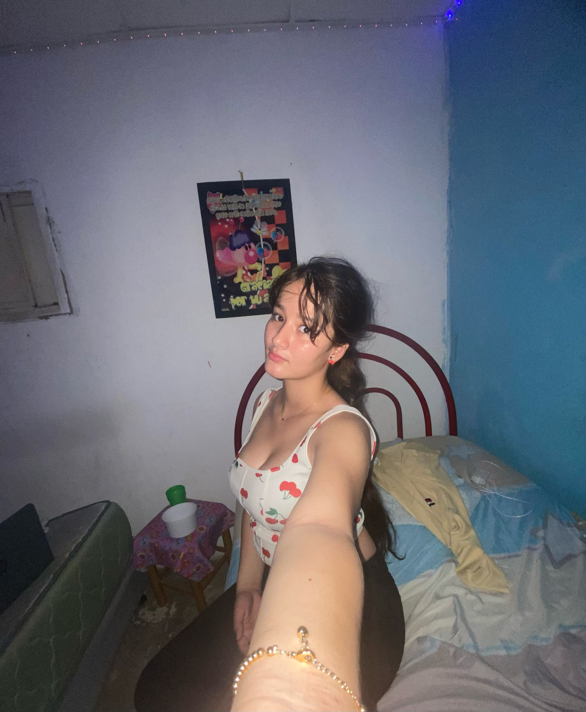

# Mi perfil

esto es una tarea para una clase de control de versiones, tiene como objetivo  describir  un poco de mi perfil,y ser evaluado para la clase de control de versiones.

## Step 1: Descripción de mi perfil
Escribi sobre mi
Escribi mis intereses
## Step 2: Información personal
contacto de mi GITHUB

## Creditos
>Autora: Alejandra Aristizabal Muñoz
>Correo: Aristizabalaleja63@gmail.com
> 

